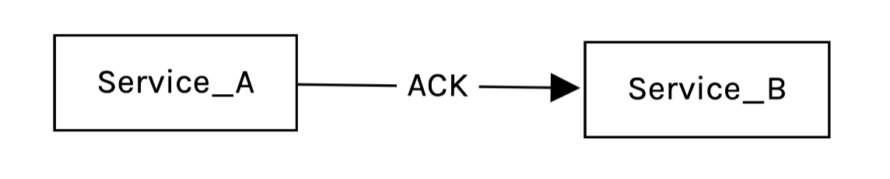
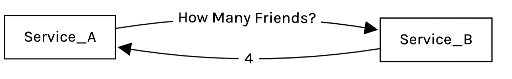
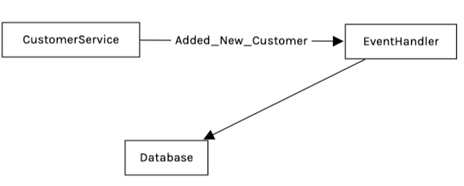
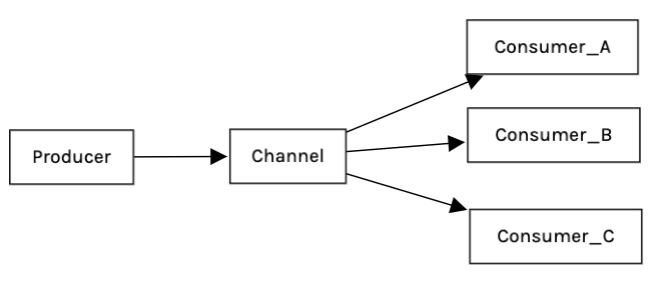
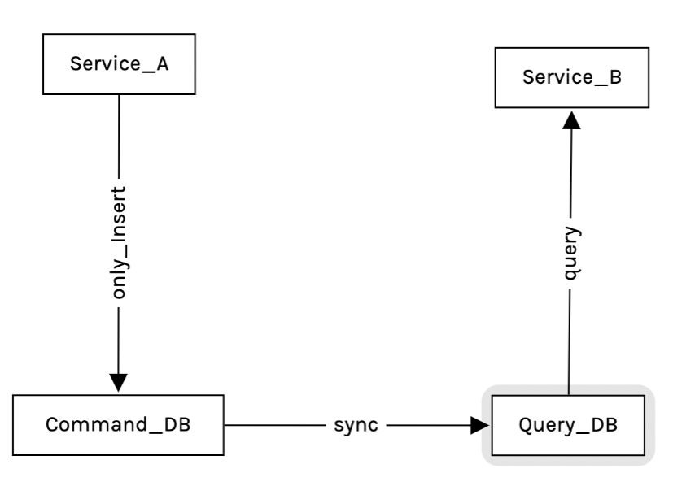

# Event Driven Architecture

## Index

1. Command And Query
2. Event
3. Event Driven Architecture
4. Event Sourcing And CQRS

## As a Point

### 1.Command And Query

> Command



    - Do Something
    - Usaully Synchronous
    - Sometimes returns a response
    - CAlling service needs to know who handles the command

> Query



    - Retrieve data
    - Almost always synchronous
    - Always returns a response
    - Calling service needs to know who handles the query

### Command And Query Problem

> Performance

    - 두개의 방식모두 동기방식으로 운영 -> 느려짐

> Coupling

    - 두개의 방식모두 다른 서비스를 호출 -> 만약 서비스가 바뀐다면 -> 결합성 이슈 생길수 있음

> Scalability

    - 두개의 방식모두 다른 서비스를 호출 -> 한개의 인스턴스라면, 내부에서 많은 통신일 일어나게 됨(busy) -> 다른 인스턴스로 확장할순 있지만 어려움(관리)

### 2. Event



> Complete Event

    - Contains all the relevant data
    - Usually entity data
    - 보통의 데이터를 뜻함

```json
    "event_type"    : "CustomerCreated"
    "customer_id"   : 1
    "first_name"    : "lee"
    ...
```

> Pointer Event

- Retrieve Complete Data in Stored Database

```json
    "event_type"    : "CustomerCreated"
    "customer_id"   : 1
```

## 3. Event Driven Architecture



> Producer

    - 이벤트 생성 시 다른 채널로 해당 이벤트를 전송/발송 한다

> Channel

    - RabbitMQ
    - Kafka
    - Usually Use Queue

> Consumer

    - Execute Event
    - Sometimes Return value (ACK)
    - Push / Pull 메커니즘 사용

### Advantages of EDA

> Performance

    - EDA is an Asynchronous Architecture (the opposite Command and Query)
    - The Channel Does not wait for response from consumer
    - Solution of Performance (Command and Query)

> Coupling

    - producer -> Channel
    - Channel은 topic기준 queue로 관리가 됨

> Scalability

    - Many Consumer can listen events from channel

> EDA와 Pubsub의 차이점

    - EDA는 전체적인 개념임 -> 이벤트 기반의 구조를 뜻함
    - Pubsub은 Publisher / Subscribe 기반의 메시징 시스템을 뜻함 -> 더 소규모 개념임
    - EDA와 pubsub은 유사한 개념이나, EDA 구조안에 pubsub 개념이 있다고 생각하면 됨

```txt
    우리 시스템은 Event Driven Architecture를 사용하고 있으며,
    그 안에서 배달 시스템은 Pubsub 구조를 채택하고 있다.
```

### Event Sourcing And CQRS

> Example Employee Table in RDB

| emp_id | first_name | last_name | address | role     | date_join  |
| ------ | ---------- | --------- | ------- | -------- | ---------- |
| 1      | john       | smith     | seoul   | backend  | 2009-04-23 |
| 2      | sahra      | adsf      | busan   | frontend | 2001-05-23 |
| 3      | culre      | basf      | incheon | data     | 2003-09-23 |

> 해당 테이블로 알수 없는 질문

    - john의 이전 role은 무엇인가요? -> 알수없음
    - sahra의 이전 주소는 어디인가? -> 알수없음
    - culre의 이전이름이 있다면 무엇인가? -> 알수없음
    - 이러한 Log성 데이터가 필요하다 -> CQRS로 이방식을 해결할 수 있다.

> Event Sourcing

    - 계속 바뀌는 데이터의 패턴을 Capture하는 방식
    - 해당 데이터를 삭제하거나 업데이트 하지 않고, 계속 insert 하는 방식
    - Event Store

    ```
       event_id          timestamp          type           event
       1                 20230101           create          employee join who john is cloud enginner
       2                 20230102           update          update role whe john is backend
       3                 20230103           sahra           move to address incheon
       ...

       - john의 이전 역할은? 클라우드 엔지니어
       - sahra의 이전주소는? 인천
    ```

    - Props
        - 해당 방식을 사용하게 된다면 -> 이전의 데이터(history)를 검색하기에 유리하다
        - 간단한 데이터 구조를 사용할 수 있다.
        - 간단한 형태의 데이터를 핸들링 가능하다 (no update, no concurrency -> very fast insert)
    - Cons
        - 현재의 데이터를 찾기 어려울 수 있다.
        - 계속 데이터가 쌓이기때문에, 많은 양의 공간이 필요하다 (Many Records Per Entity)

> CQRS (Command and Query Responsibility Segregation)



    - Command 용 데이터 베이스를 구축 -> Only Insert -> NoSQL (MongoDB, RTDB, DynamoDB, CouchBase*)
    - Query 용 데이터 베이스를 구축 -> Retrieve -> RDB (MySQL)

    - Props
        - 대용량의 읽기 요청이 있을경우, Read 하는 부분 (Query), Update하는 부분 (Command)이 나뉘어져 있어서 -> 큰 부하에 견딜 수 있다.

    - Cons
        - 보통 Command용 데이터에서 Query용 데이터로 Sync를 맞추기 때문에 정합성이 실시간으로 업데이트 되지 않을 수 있다.
        - 2개의 데이터베이스를 운용해야 히기때문에 Handling하기 어려울 수 있다.

    - UseCase
        - Historical data가 정말 중요할 때 ex) 입,출금이력, 구매이력, HealthCare
        - Read하는 부분, Update하는 부분을 나눠야 할때 Performance, 부하분산
