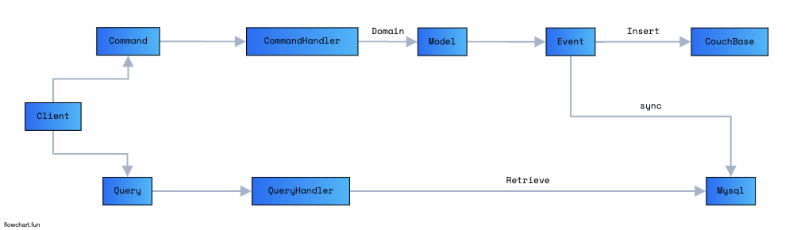

# 고객 주문 관리 시스템 use CQRS

## CQRS

- Client -> Command -> Handler -> Model -> CouchBase(EventStore)
- Event -> Sync -> MySQL(Query Database)

## 동작방식

- 고객이 가게를 조회한다.
  - [ ] 고객 데이터 (Model)
  - [ ] 가게 데이터 (Model)
- 여러 가게 중 하나를 선택하고 -> 해당 가게에 음식을 조회한다.
  - [ ] 가게의 음식데이터 (Model)
  - [ ] 가게 조회 (Service)
  - [ ] 음식 조회 (Service)
- 음식을 조회 ,변경을 진행한다.
  - [ ] 음식 Detail (Model)
  - [ ] 음식 조회 (Service)
  - [ ] 음식 변경 (Service)
- 음식을 변경, 확정을 진행한다. -> 배달 주문
  - [ ] 음식 확정 (Service)
  - [ ] 배달 데이터 (Model)
